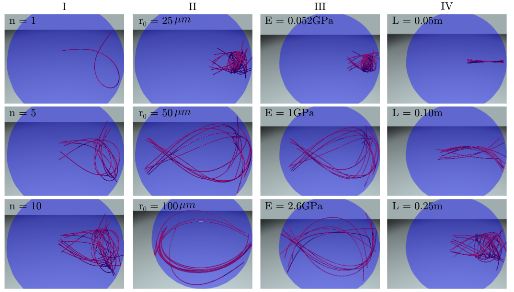

## Fiber Bundling Simulation

Entanglement of Elastic Rods Under Low Reynolds Number, Resembling
Gastric Trichobezoar

The numerical framework for simulating the entanglement of elastic rods in the viscous fluid (under low Reynolds number) for resembling gastric trichobezoar. Uses [Discrete Elastic Rod (DER)](http://www.cs.columbia.edu/cg/pdfs/143-rods.pdf) framework and incorporates contact from [this article](https://onlinelibrary.wiley.com/doi/abs/10.1111/j.1467-8659.2008.01147.x)

<p align="center">

<br>
<em> Figure 1. Simulation examples for the entanglement of elastic rods under low Reynolds number. </em>
</p>

***

## How to Use

### Dependencies
Install the following C++ dependencies:
- [Eigen](http://eigen.tuxfamily.org/index.php?title=Main_Page)
  - Eigen is used for various linear algebra operations.
  - The simulation tool is built with Eigen version 3.4.0 which can be downloaded [here](https://gitlab.com/libeigen/eigen/-/releases/3.4.0). After downloading the source code, install through cmake as follows.
    ```bash
    cd eigen-3.4.0 && mkdir build && cd build
    cmake ..
    sudo make install
    ```
    
- [OpenGL / GLUT](https://www.opengl.org/)
  - OpenGL / GLUT is used for rendering the knot through a simple graphic.
  - Simply install through apt package manager:
      ```bash
    sudo apt-get install libglu1-mesa-dev freeglut3-dev mesa-common-dev
    ```
- Lapack (*usually preinstalled on your computer*)

***
### Compiling
After completing all the necessary above steps, clone the source repository of IMC and then build the project through cmake.
```bash
mkdir build && cd build
cmake ..
make -j4
```

***

### Setting Parameters

All simulation parameters are set through a parameter file ```option.txt```. A template ```option.txt``` file is provided.

Specifiable parameters are as follows (we use SI units):
- ```RodLength``` - Contour length of the rod.
- ```rodRadius``` - Cross-sectional radius of the rod.
- ```youngM``` - Young's modulus.
- ```Poisson``` - Poisson ratio.
- ```deltaTime``` - Time step size.
- ```totalTime``` - Total simulation time.
- ```tol``` and ```stol``` - Small numbers used in solving the linear system. Fraction of a percent, e.g. 1.0e-5, is often a good choice.
- ```maxIter``` - Maximum number of iterations allowed before the solver quits. 
- ```density``` - Mass per unit volume.
- ```gVector``` - 3x1 vector specifying acceleration due to gravity.
- ```viscosity``` - Viscosity for applying damping forces.
- ```numVertices``` - Number of nodes for expressing a rod
- ```render (0 or 1) ```- Flag indicating whether OpenGL visualization should be rendered.
- ```saveData (0 or 1)``` - Flag indicating whether to record the simulated rods' configurations.
- ```data-period``` - Rate of data recording in seconds. Applies to both ```saveData```.
- ```insertion-time``` - The time it takes to insert one rod into the fluid.
- ```wait-time``` - The time it waits before inserting the next rod once the current rod is fully inserted.
- ```total-rods``` - The total number of rods that will be inserted into the tank.
- ```boundary-iter``` -
- ```radiusofSphere```

***
### Running the Simulation
Once parameters are set to your liking, the simulation can be ran from the terminal by running the provided script:
```bash
./simDER option.txt
```
***


